# Artist Comparison and Historical Journey Framework

> **This is built on synthetic data.**

A&R and marketing leads decide which artists to fund on a limited budget, usually from raw stream counts that flatten momentum, reach, and timing into one number. This framework places every artist against the full field on a development plane, then layers a log space vector autoregression forecast and a breakthrough classifier on top, so each act reads as a trajectory rather than a snapshot. The payoff is an investment shortlist that separates artists compounding into the strong corner from those coasting on a single hit, with every score reproducible from the weekly series.

**Live demo:** https://k1monfared.github.io/artist_journey/ , the interactive dashboard you can open in a browser.

## Outputs

Here are questions an Artists and Repertoire (A&R) or marketing investment lead
walks in with, answered from this repository's committed run. Positions are read
as (reach, streams), each axis centered so 0 is the field median and the high
reach high streams corner is above 0 on both. Each answer shows the chart it
comes from, and each one states plainly what this analysis adds on top of the
streams and placement counts a standard dashboard already reports.

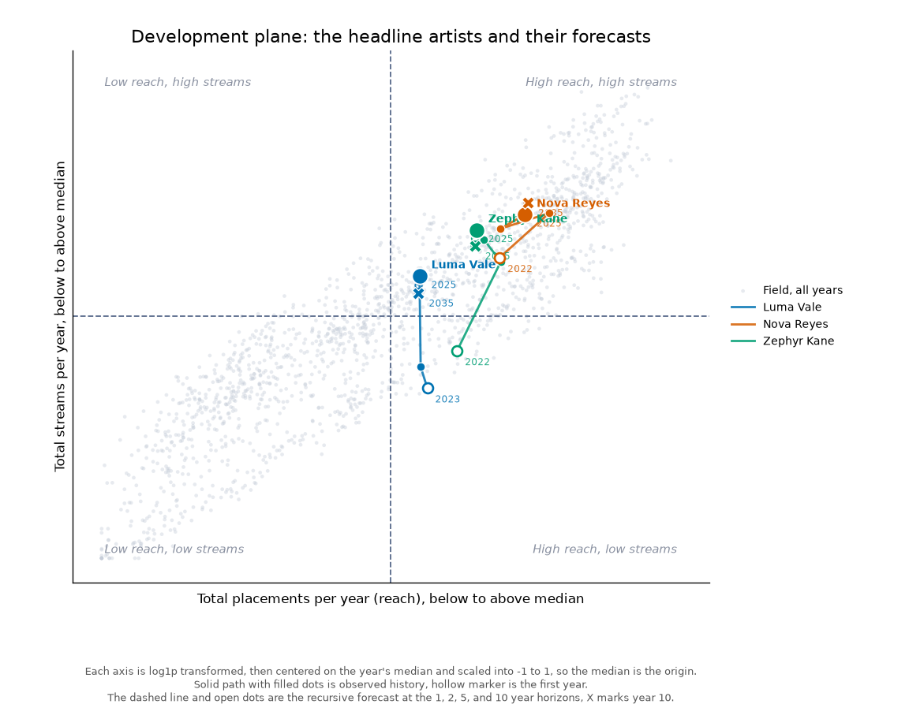

*The plane behind the answers: [Luma Vale](https://www.youtube.com/watch?v=_EZtJmNXXnA) at (0.10, 0.17) and Zephyr Kane at (0.30, 0.36) sitting above the field median on both axes, [Nova Reyes](https://www.youtube.com/watch?v=wFRi0yDHf0Y) anchored higher at (0.46, 0.42), each solid path continued by a dashed recursive forecast. This is the view a decision-maker sees, with no ground truth overlaid.*

### 1. "We can fund one more artist this quarter. Who has the strongest case?"

Luma Vale. She tops the investment ranking at 80.4 and is the only highlighted
act with clearly positive recent momentum, streams growing 2.4% per week while
every other name on the roster is flat or cooling. Her raw totals, about 681,000
weekly streams and 1.4 million followers, are small and already on every
dashboard. What this analysis adds is the context around them: normalized against
the whole field her development path climbs from (0.13, -0.30) in 2023 to (0.10,
0.17) in 2025, crossing from below the median on streams to above it, and the
recursive forecast continues that path rightward and up to about (0.18, 0.18)
over ten years as her placements keep rising. In quadrant terms she is moving into
the high reach high streams corner, the healthy one, on rising reach rather than a
single spike.

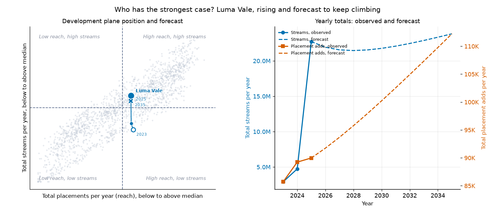

So what: fund her now, while the push is cheap and she is the one name actually
compounding into the strong corner rather than drifting there on one hit.

### 2. "Nova Reyes looks like she is spiking. Do we double down?"

Not for growth. Her raw numbers, roughly 984,000 weekly streams and 4.1 million
followers, are the largest on the roster and look like a spike on the weekly
chart. What this analysis adds is that the spike is not new growth: her recent
momentum is 0.0% per week, her rank 3 score of 60.0 rests on reach and
acceleration rather than fresh momentum, and on the plane she is already parked
high at (0.46, 0.42) in the high reach high streams corner. The recursive forecast
barely moves her, holding near (0.49, 0.42) over ten years, which is exactly what
a mature, saturated position looks like when it is projected forward.

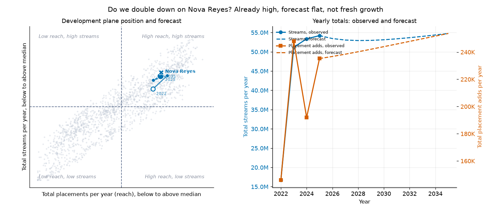

So what: hold her as a high reach anchor, do not pay a growth premium for streams
the forecast says are flat.

### 3. "Can we trust an early flag before an act gets expensive?"

On this run, yes. Zephyr Kane's raw streams and placements were unremarkable early
on. What this analysis adds is a read on his early position that the raw counts do
not give: the breakthrough model, using only his 2022 quadrant coordinates and one
year of movement, gave him a 0.86 breakthrough probability from a spot that was
still below the field median on streams at (0.23, -0.14). By 2025 he had climbed to
(0.30, 0.36), above the median on both, and the recursive forecast holds him there.
Across held out artists the model reaches ROC AUC 0.879 and recall 0.75 against a
19.2% base rate, so the early flag is not a one off.

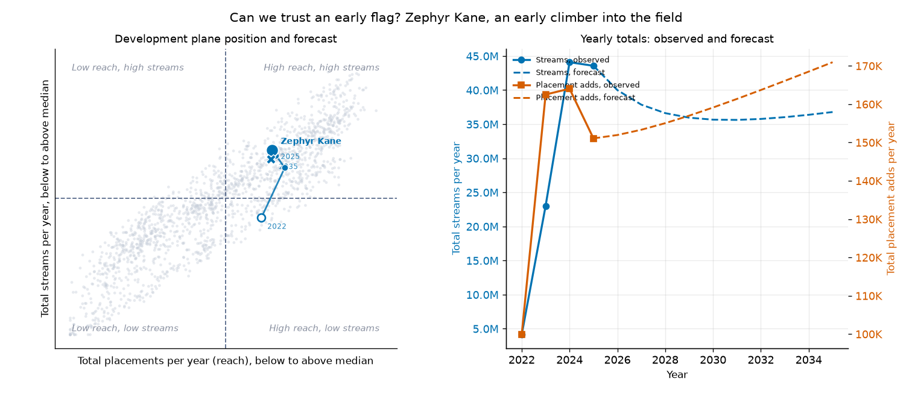

So what: when the model flags a low priced act early, the signal has been right
often enough here to justify a small early position, with the caveat that this is
a synthetic run.

The pieces behind the answers are a development quadrant that places every artist
against the whole field per year on a fixed plane, a recursive forecast that
continues each artist's streams and placements forward and maps them back onto the
plane, trajectory and career age views that compare acts on calendar time and on
months since debut with both raw and normalized values, an investment ranking that
scores and explains each name, and a breakthrough model that flags likely emergers
from early position. Most of it is delivered as a tabbed interactive dashboard, and
the rest of this document is how each of those numbers is produced.

---

## Contents

- [How to run](#how-to-run)
- [The development quadrant](#the-development-quadrant)
- [How the quadrant is built](#how-the-quadrant-is-built)
- [The other views](#the-other-views)
- [Breakthrough prediction](#breakthrough-prediction)
- [The interactive dashboard](#the-interactive-dashboard)
- [Definitions](#definitions)
- [Assumptions and limitations](#assumptions-and-limitations)
- [What a production version would add](#what-a-production-version-would-add)

## How to run

Interactive demo: 
```
sh demo.sh   # serves the page on a free local port and opens your browser
```

FOSS only. A clean virtual environment is the simplest path.

```
python -m venv .venv
source .venv/bin/activate
pip install -r requirements.txt
python scripts/run_demo.py
```

`scripts/run_demo.py` is the single entry point. It regenerates the data, the
metrics, the quadrant, the recursive forecast, the breakthrough model, the
outputs, the JSON payload, and all figures. Because everything is seeded,
repeated runs produce identical files. The console prints a six step progress
log, the transform comparison, the model versus baselines, and the final
shortlist.

The dashboard fetches a JSON file, so serve the `docs` folder over HTTP rather
than opening the file directly. `demo.sh` does this for you, or serve it by hand:

```
cd docs
python -m http.server 8000   # then open http://localhost:8000/index.html
```

Individual stages can also be run on their own:

```
python scripts/generate_data.py      # just the CSV tables in data/
python scripts/generate_figures.py   # just the PNGs in docs/images/
```

### What gets written

- `data/artists.csv`: metadata for all 300 pool artists with a highlight flag.
- `data/timeseries.csv`, `data/releases.csv`: weekly series and release events
  for the 12 highlighted artists only, 3,794 weekly rows and 228 releases.
- `data/pool_yearly.csv`: per artist per year totals of streams and placements
  for the whole pool, the quadrant field.
- `outputs/investment_report.md`, `outputs/rankings.json`,
  `outputs/metrics_summary.json`: the ranking and metrics.
- `outputs/transform_analysis.json` and `.md`: the quadrant transform comparison.
- `outputs/prediction.json` and `.md`: the breakthrough definition, model
  metrics, baselines, and sample predictions.
- `outputs/forecast.json` and `.md`: the recursive forecast model, its log space
  coefficients, held out error, and example ten year artist paths.
- `docs/data.json`: the payload the dashboard consumes, with the quadrant field,
  highlighted trajectories with raw and normalized values, and the recursive
  forecast per artist.
- `docs/images/*.png`: the figures embedded in this document, including the
  three headline scenario charts and the development plane with forecasts.

---

## The development quadrant

The development quadrant is the main view. It is a fixed plane that answers a
relative question: for a given year, where does an artist stand against the
entire field on reach and on scale, and which way are they moving over time.

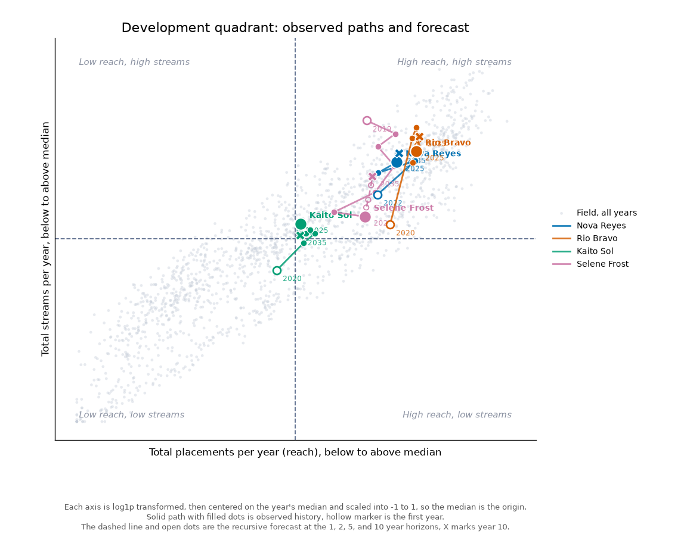

- The vertical axis is total streams for the year. The horizontal axis is total
  placements for the year, playlist plus editorial placements, which is the
  reach dimension.
- The plane is fixed at [-1, 1] by [-1, 1] every year, so positions are always
  read the same way.
- Each axis is centered on the year's median, so the median maps to 0 and the
  dividing cross-hair is always at the origin (0, 0). The upper right quadrant is
  simply both coordinates above 0. Because every year is centered the same way,
  the background field looks the same each year, so a single stable cloud of all
  artist years is shown rather than a per year toggle.
- Each highlighted artist is a trajectory across years, one dot per year
  connected in year order, all years shown at once, so you watch them move
  relative to the field.
- Two toggles sit above the chart. Show history switches between the full year
  by year path and only the artist's most recent position. Show predictions
  continues each path with the recursive forecast, a dashed line to the 1, 2, 5,
  and 10 year ahead positions extending from the latest observed point. The two
  compose freely.
- Every point, observed or forecast, carries both readings in its hover popup:
  the normalized (reach, streams) coordinates and the raw yearly totals, with the
  unit on the placement number.

### Reading the four quadrants

The names describe where a point sits, not whether that is good or bad, because
the same corner can mean either. The axes split at the yearly medians, so the
origin is the field median and the sign of each coordinate says above or below
median on reach and on streams. Direction of travel usually matters more than the
static spot.

- **High reach, high streams** (top right, above the median on both). Usually the
  healthy corner: wide distribution and a large audience that have grown together,
  the reach converting into streams. The good case is an established act whose two
  totals rose in step. The less good case is a temporary peak, both totals lifted
  at once by a single recent hit, which the forecast may pull back. A high spot
  alone does not say which, so read whether the path arrived steadily or jumped.

- **Low reach, high streams** (top left, narrow distribution yet high streams). A
  concentrated audience arriving through a few channels rather than broad
  placement. Often a good, efficient sign: streams are there on little placement,
  an organic pull worth widening with more distribution. It can also be a loyal
  catalog core with little new placement activity, which is stable but limited. The
  warning version is placements that have lapsed while streams have not yet
  followed them down, which is a bad sign if the reach keeps falling.

- **High reach, low streams** (bottom right, wide distribution yet low streams).
  The corner that most often carries a negative read, but not always. The bad
  cases are an act that was hot and is now cooling, reach lingering on playlists
  while streams fall, or an act where heavy placement was bought and never
  converted, an over invested, inefficient position. The good case is a very new,
  widely seeded act whose streams simply have not caught up yet, which is promising
  if streams are rising. Same corner, opposite meaning, decided by the direction of
  travel.

- **Low reach, low streams** (bottom left, below the median on both). Ambiguous on
  its own. The good case is a genuinely early or emerging act, small and cheap,
  worth catching if it is moving up and to the right. The bad case is a dormant or
  fading act, small on both and going nowhere. Position alone cannot separate them,
  movement can.

In this run Nova Reyes and [Rio Bravo](https://www.youtube.com/watch?v=YWfAZPK01QE) climb from the lower band up into the high
reach high streams corner. [Kaito Sol](https://www.youtube.com/watch?v=OaOZiXUKNAA) is a slow burn that stays near the median.
Selene Frost drifts right while sliding down, the high reach low streams pattern of
an act cooling with its reach still lingering. Because the plane is centered on the
median every year, the frame never shifts, so an artist's path across the plane
reflects real movement against the field rather than a moving reference.

---

## How the quadrant is built

The strength of the quadrant is that positions are relative to a real
distribution, so the construction matters.

- The pool is a large synthetic field of 300 artists so that per year
  percentiles are meaningful. A handful are highlighted and traced, the rest
  form the background field.
- For each calendar year, every artist's weekly streams and placements are
  summed to per year totals. Only years with enough weeks of data are kept,
  which drops partial debut years and the partial final year.
- For each year independently, each axis is transformed (see below), then
  centered on that year's median and scaled into -1 to 1. Concretely, subtract
  the year's median so it maps to 0, then divide by the maximum absolute
  deviation from that median so every value lands within -1 to 1. Magnitude
  order is kept, this is not a rank transform.
- Because the median maps to 0 on both axes, the cross-hair is always at the
  origin, and the four quadrants are read straight off the signs of the two
  coordinates.

### The two axes are correlated, and that is faced squarely

The two axes are not independent. Across the 1,667 artist years plotted on the
plane, the Pearson correlation between the horizontal placements axis and the
vertical streams axis is about 0.90. On pure statistics that is a weak basis for a
two dimensional plot: the field is nearly one dimensional, and a plane that packs
almost all of its variance onto the diagonal is close to drawing one dimensional
data in two dimensions. There is no dressing that up.

It is kept anyway, as a considered choice rather than an inherited default. These
two axes are exactly the quantities an A&R team already reasons with day to day,
placements as the lever they pull and streams as the outcome they watch, and this
is the view they use to make decisions. A technically purer, decorrelated
projection that they will not read is worse than the familiar plane they will act
on, and one analysis does not get to reset how an entire industry frames its own
work.

The value here is also not the diagonal bulk. That popular artists get more
placements is unsurprising and carries little information. The signal is the off
diagonal movement: an artist drifting vertically or horizontally relative to the
cloud, gaining streams on flat placement or piling up placement that is not
converting, is the anomaly worth attention. That is what the plane is actually for,
and reading direction of travel rather than position is how you use it.

### Choosing the axis transform from the data

Streams and placements totals are heavily right skewed. Even with median
centering, a raw scale would leave most artists bunched near 0 while a few
outliers stretch to the edges, which makes the plane uninformative. So each axis
is transformed before centering, and the transform is chosen from the data, not
by assertion.

Criterion: minimize the mean absolute Fisher Pearson skewness of the pooled
artist year totals across the two axes, restricted to smooth magnitude
preserving transforms. Lower absolute skewness means the points spread across
the plane instead of bunching near the center and saturating at the extremes.
The candidates were scored on the actual simulated pool:

| Transform | Streams skew | Placements skew | Mean abs skew |
|-----------|-------------:|----------------:|--------------:|
| identity | 2.018 | 1.305 | 1.661 |
| sqrt | 1.076 | 0.635 | 0.856 |
| log1p (chosen) | -0.218 | -0.117 | 0.168 |
| rank (reference) | 0.000 | 0.000 | 0.000 |

log1p wins among the smooth transforms, cutting mean absolute skewness from
1.661 raw to 0.168, close to symmetric. The rank, or quantile, transform reaches
zero skewness by construction, but it is reported only as a reference lower bound
and is not selected: it would space every artist evenly by rank and discard the
magnitude differences the quadrant is meant to show. Median centering already
puts the axes at the origin, so the rank transform buys nothing there while
costing the magnitude signal. The full comparison is written to
[outputs/transform_analysis.md](outputs/transform_analysis.md) and
[outputs/transform_analysis.json](outputs/transform_analysis.json).

### Forecasting streams and placements forward

The Show predictions toggle continues each artist's path with a recursive
forecast. Rather than predicting plane coordinates directly, it forecasts the two
raw yearly totals and then maps them onto the plane with the same cloud
normalization used for the observed points, so a predicted year sits in the same
space as the history it continues.

The two totals move together, so they are forecast together. Next year's streams
are predicted from this year's streams and this year's placements, and next year's
placements from this year's placements and this year's streams, so each variable
carries the other forward. This is a first order vector autoregression, one linear
step fit in log space on the year over year transitions pooled across every artist
in the pool. Log space keeps the heavy right skew of both totals in check and makes
each step multiplicative, which is the natural scale for growth. A small ridge
penalty keeps the two by two fit stable. To reach further out the single step is
applied recursively: the predicted year becomes the input for the next year,
stepping forward ten years. Because each artist starts from their own most recent
totals and the two variables feed each other, the paths differ per artist and keep
evolving, rather than collapsing to a shared constant.

The fitted one step transition, in log space, is:

| Next year | log streams | log placements | intercept |
|-----------|------------:|---------------:|----------:|
| log streams | 0.663 | 0.327 | 1.944 |
| log placements | -0.036 | 1.019 | 0.412 |

Streams next year load on both current totals, which is how strong placements pull
streams up. Placements next year are close to a random walk on themselves with a
small streams term. Fit on 914 pooled year over year transitions and evaluated on
453 transitions from held out artists, the one step error in raw units, as the
median absolute percentage error, is:

| Axis | Model | Persistence baseline |
|------|------:|---------------------:|
| Streams | 16.4% | 17.1% |
| Placements | 14.0% | 13.5% |

The model edges persistence on streams, where the placement cross term helps, and
essentially ties it on placements, which are close to a random walk here. This is a
sensible, careful first pass, not a tuned forecaster. Multi year paths are the one
step applied recursively, so error compounds and the later years are best read as
direction, not a point estimate. The coefficients, held out error, and example ten
year paths are written to [outputs/forecast.md](outputs/forecast.md) and
[outputs/forecast.json](outputs/forecast.json).

One subtlety is worth stating plainly, because it changes how the predicted
trajectory reads. The plane coordinates are normalized by year against the full
field of artists that year, so a position is a standing relative to peers, not an
absolute level of streams and placements. The observed points are centered on each
observed year's field. To keep the forecast on the same footing, every pool artist
is forecast forward too, and each predicted year is centered on the field predicted
for that same year. A predicted position therefore says where an artist sits among
peers who are also predicted to move.

The consequence is that a predicted path can head in a direction that looks
different from, even perpendicular to, an artist's own raw trend. Luma Vale is the
clear case here. Her raw yearly streams hold roughly flat to slightly up over the
forecast and her placements keep climbing, yet her normalized streams position eases
from 0.17 at 2025 down toward 0.10, because the rest of the field is predicted to
rise around her. Standing still while the field advances shows up as a drift down
and sideways on the plane even though no raw number fell. Selene Frost is the mirror
case, her predicted streams rise faster than the field and her normalized position
climbs from 0.17 to 0.34. Read the normalized path as movement against peers, and
read the raw yearly totals underneath it for the absolute story.

This forecast answers a different question from the breakthrough classifier below.
The forecast says where an artist's totals, and so their plane position, are
heading. The classifier gives a single breakthrough probability. They are
complementary, one is a trajectory, the other is a yes or no likelihood.

---

## The other views

The dashboard wraps three more views around the quadrant, computed on a
highlighted roster of 12 named artists with full weekly history.

### Single artist journey

Nova Reyes is a breakout archetype. The journey view shows the quiet early
period, the sharp climb, and the recurring lift around album releases.

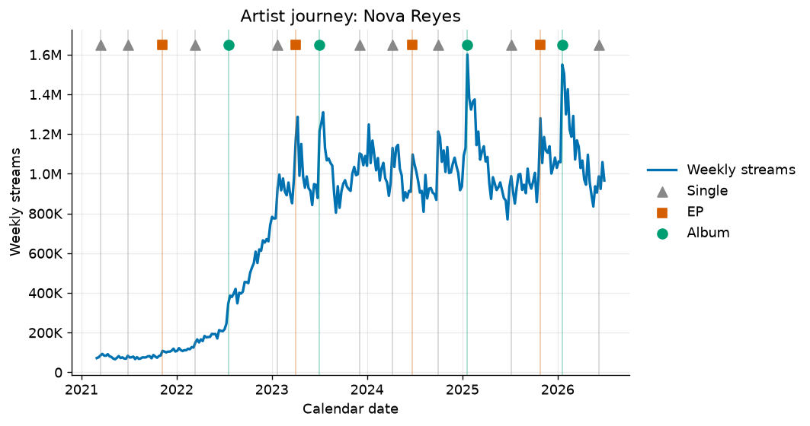

### Career age comparison

On calendar dates the artists are hard to compare because they debuted years
apart. Aligned on career age, months since debut, the story is clearer: Rio
Bravo and Nova Reyes climb fastest per career month, while Selene Frost peaks
early and fades.

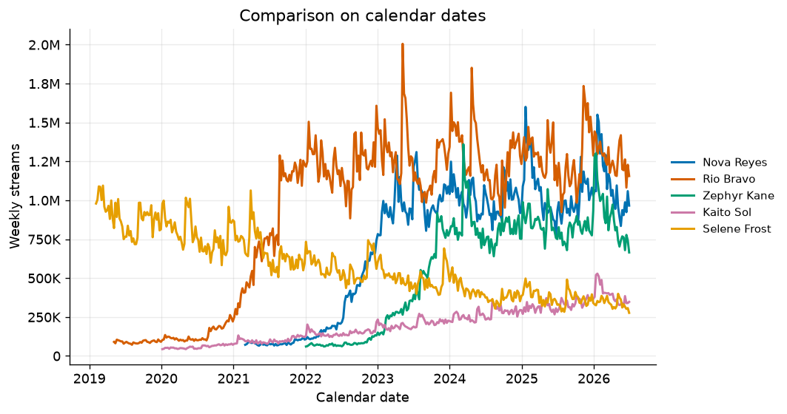

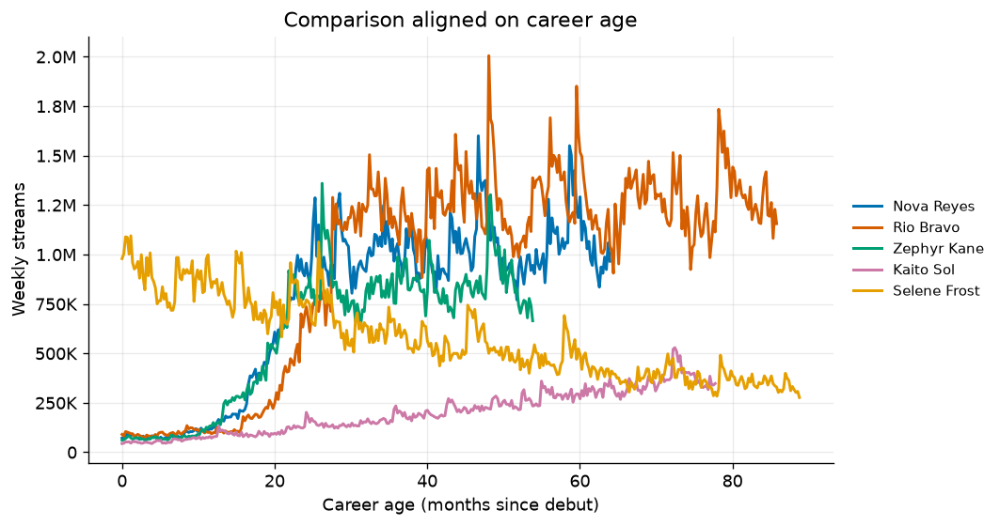

In the dashboard this view keeps the raw weekly series and adds the yearly totals
of streams and placement adds beneath it, aligned on years since debut and
continued by the recursive forecast. Each yearly point carries both readings in
its hover: the raw total with its unit and the normalized value on the development
plane, so two artists can be compared at the same career age on both the raw
numbers and their standing against the field.

The projected trajectory below extends one artist's yearly streams forward with
the recursive forecast, the same log space vector autoregression that continues
each path on the development plane, stepped forward year by year from the last
observed year rather than a log linear weekly extrapolation.

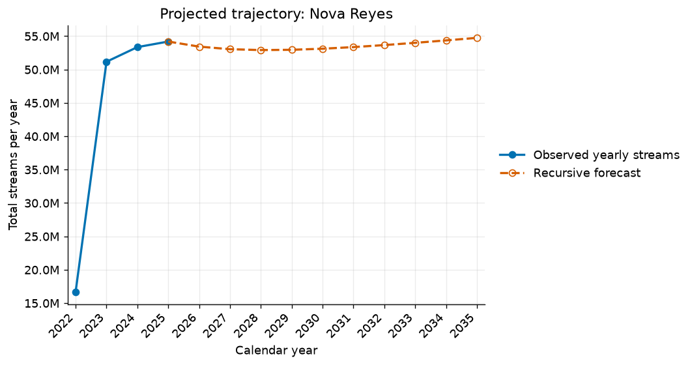

### Investment ranking

The score is fully reproducible from the weekly series, and this is the exact
computation, matching `compute_artist_metrics` and `score_investment` in
[src/metrics.py](src/metrics.py). It is scored over the 12 highlighted artists
only, not the pool.

Step one, six raw per artist signals from the weekly streams and playlist adds:

- Momentum: compound weekly growth of streams over the last 12 weeks. Take the
  last 12 weekly stream values, clip to at least 1, fit a line to their natural
  log against week index by least squares, and report `exp(slope) - 1`. Using the
  log linear slope rather than endpoint over endpoint keeps one noisy week from
  dominating.
- Growth: the same log linear compound weekly growth over the last 26 weeks.
- Acceleration: momentum minus growth, so positive means the recent 12 week pace
  is above the 26 week pace.
- Volatility: the standard deviation of weekly log returns of streams over the
  last 26 weeks.
- Current streams: the mean of the last 4 weekly stream values.
- Traction: mean playlist adds over the last 26 weeks divided by mean streams over
  the last 26 weeks, a demand side ratio.

Step two, put five of these on a common 0 to 1 scale across the 12 artists with
min max scaling, `(v - min) / (max - min)` over the roster, or all zeros if the
column is flat:

- `reach_n` scales `log(1 + current_streams)`, so scale is on a log axis.
- `momentum_n` scales momentum, `acceleration_n` scales acceleration,
  `traction_n` scales traction.
- `steadiness_n` is `1 - minmax(volatility)`, so steadier artists score higher.

Step three, the score is a fixed weighted sum of the five scaled signals,
multiplied by 100 and rounded to two decimals:

```
score = 0.34*momentum_n + 0.22*acceleration_n + 0.18*reach_n
      + 0.14*traction_n + 0.12*steadiness_n
investment_score = round(100 * score, 2)
```

The weights sum to 1 and are a transparent business choice, not a fitted model:
recent momentum leads, acceleration and reach follow, then playlist traction and
consistency. Nothing from the quadrant, the recursive forecast, or the
breakthrough model feeds this score, they are separate views. Step four, sort by
`investment_score` descending to assign ranks 1 upward. The sort is stable, so any
exact ties keep their prior order, which is by artist id. With the same weekly
series a reader can recompute every number and reproduce the ranking.

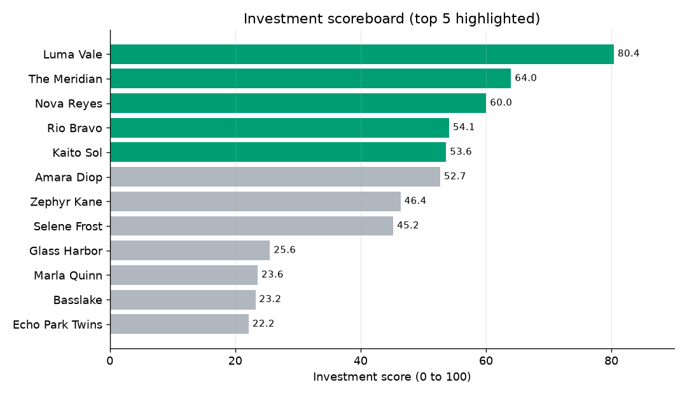

Top five for this run:

| Rank | Artist | Genre | Score | Momentum / week |
|-----:|--------|-------|------:|----------------:|
| 1 | Luma Vale | R&B | 80.4 | 2.4% |
| 2 | [The Meridian](https://www.youtube.com/watch?v=jGAj1XSbe1c) | Rock | 64.0 | 0.0% |
| 3 | Nova Reyes | Pop | 60.0 | 0.0% |
| 4 | Rio Bravo | Latin | 54.1 | -0.4% |
| 5 | Kaito Sol | Electronic | 53.6 | -0.2% |

The full board and every rationale live in
[outputs/investment_report.md](outputs/investment_report.md) and
[outputs/rankings.json](outputs/rankings.json).

---

## Breakthrough prediction

Can an artist's early quadrant position predict whether they break through
later. This is a small, careful classification study on the pool.

Definition of breakthrough: an artist breaks through if, in the target year (the
observation year plus 3 years), they are in the upper right quadrant, both
centered coordinates above 0, or in the top quartile of centered streams, having
started below that at the observation year. Since the axes are centered on the
yearly median, the origin is the median, so above median and above 0 are the
same test. Artists already in that region at observation are excluded, so the
task is genuinely about emergence. The observation point is each artist's first
full year on the plane.

Features are only observable quadrant coordinates: the normalized placements and
streams at the observation year, and their movement over the following year. The
generative archetype is never used, that would be leakage.

Base rate: breakthrough happens for 19.2% of the 130 eligible artists, so it is
the minority class. The model is a logistic regression with balanced class
weights (without balancing it predicts all negative at the 0.5 threshold, which
hides its ranking ability). It is trained on 91 artists and evaluated on a held
out 39.

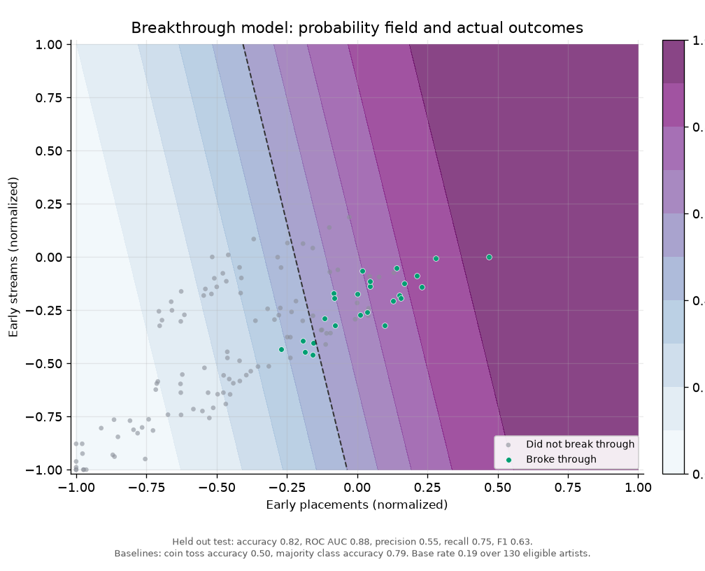

Held out performance against two baselines:

| Model | Accuracy | ROC AUC | Precision | Recall | F1 |
|-------|---------:|--------:|----------:|-------:|---:|
| Logistic regression | 0.821 | 0.879 | 0.545 | 0.750 | 0.632 |
| Coin toss | 0.500 | 0.500 | . | . | . |
| Majority class | 0.795 | 0.500 | . | . | . |

Confusion matrix on the test set, with the predicted call down the leading
column and the actual outcome across the header row:

| Predicted | Actual: no breakthrough | Actual: breakthrough |
|-----------|------------------------:|---------------------:|
| No breakthrough | 26 | 2 |
| Breakthrough | 5 | 6 |

The 26 and 6 on the diagonal are the correct calls. The 5 false positives are
artists whose early position looked promising but who never broke through, and
the 2 false negatives are late bloomers that jumped from a weak early position
the model could not read. The model beats a coin toss clearly and edges the
majority baseline on accuracy, but the important difference is that it actually
recovers breakthroughs, recall 0.75, where the majority baseline never predicts
one. The AUC of 0.879 says early position ranks future breakthrough well on this
synthetic pool. That signal is stronger than a real setting would give, because
the synthetic archetypes make trajectories persistent, so treat it as an
illustration of the method, not a claim about real catalogs. Moving to median
centered coordinates left these numbers unchanged, because centering is a
monotone per year rescale, so above the median and above 0 pick out the same
artists and labels.

A few example predictions from the held out set:

| Case | Artist | Early placements | Early streams | Probability | Predicted | Actual |
|------|--------|-----------------:|--------------:|------------:|:---------:|:------:|
| TP | Pool Artist 0196 | 0.10 | -0.32 | 0.77 | breakthrough | breakthrough |
| TN | Pool Artist 0088 | -0.77 | -0.80 | 0.07 | no | no |
| FP | Pool Artist 0054 | 0.08 | -0.09 | 0.73 | breakthrough | no |
| FN | Pool Artist 0093 | -0.27 | -0.43 | 0.38 | no | breakthrough |

Coordinates are median centered, so 0 is the median. The false positive sat
just above the median early yet did not break through. The false negative started
well below the median and jumped anyway, which early position cannot see. The
model, metrics, and all sample cases are written to
[outputs/prediction.json](outputs/prediction.json) and
[outputs/prediction.md](outputs/prediction.md).

---

## The interactive dashboard

The centerpiece is [docs/index.html](docs/index.html), a self contained page
built with vanilla JavaScript and Plotly loaded from a CDN. There is no build
step. It reads the committed [docs/data.json](docs/data.json) and is organized
into tabs, one interactive chart per tab, with the development quadrant open
first:

- Development quadrant: a fixed zero centered plane with the cross-hair at the
  origin and a stable field cloud, where each selected artist's path spans all
  years. Two toggles, Show history and Show predictions, control whether the full
  path or only the latest position is drawn and whether the recursive forecast
  continues the path as a dashed line to the 1, 2, 5, and 10 year ahead positions.
  Every point's hover shows both the normalized coordinates and the raw yearly
  totals with the placement unit.
- Trajectory over time: a single artist on calendar dates, overlay several, switch
  the metric, add release markers, the projected trajectory, or a log scale. Below
  the weekly chart, the yearly totals of streams and placement adds continue into
  the recursive forecast.
- Career-age comparison: the same weekly overlay aligned on months since debut,
  with the yearly totals below aligned on years since debut and their hover showing
  both the raw total with its unit and the normalized plane value.
- Rankings and shortlist: the investment shortlist cards and the full board.

The breakthrough classifier is no longer a separate tab. Its predictions belong
with position, so where an artist is heading now lives inside the quadrant and the
trajectory views, and the breakthrough study itself is reported here and in
`outputs/`.

### Publish on GitHub Pages

In the repository settings, under Pages, set the source to the `docs` folder on
the default branch. GitHub serves `docs/index.html` and `docs/data.json`
together, so the page works with no server of your own.

---

## Definitions

- **Total streams (per year)**: the sum of the artist's weekly streams over a
  calendar year. Only years with at least 45 weeks of data are counted, which
  drops partial debut years and the partial final year. Unit: streams per year.
- **Total placements (per year)**: the count of placement adds the artist received
  over a calendar year, that is the yearly sum of weekly playlist adds plus
  editorial adds. Each add is one event, a track being added to a playlist or
  picked up in an editorial feature, so the total is a count of add events, not a
  count of distinct playlists or a duration. Unit: adds per year (playlist plus
  editorial adds). This is the horizontal reach axis of the development plane, and
  the popups show this raw count next to its normalized value.
- **Normalized value**: a raw yearly total mapped onto the development plane by the
  cloud normalization, log1p transformed then centered on the year's median and
  scaled into -1 to 1, so 0 is the field median. See how the quadrant is built.

## Assumptions and limitations

- All data is synthetic. The archetypes, seasonality, and noise are chosen to be
  plausible and to make the views legible, not to match any real catalog.
- Because the synthetic archetypes make trajectories persistent, early position
  predicts breakthrough more strongly here than it would in a real, noisier
  setting. The prediction is an illustration of the method.
- The projection is a log linear trend with a heuristic band. It communicates
  direction and momentum. It is not a calibrated forecast.
- The investment score weights are a transparent business choice. Different
  stakeholders would tune them, which is a feature, not a defect.
- The two quadrant axes are strongly correlated, about 0.90, so the field is
  nearly one dimensional and the plane is statistically a weak use of two
  dimensions. It is kept because these are the axes A&R teams already reason with
  and the value is the off diagonal movement, as explained under how the quadrant
  is built. Finding a lower correlation representation that A&R would still read,
  and feeding a less collinear signal into a more involved forecast, is open work
  noted below, not something this run claims to have solved.
- The recursive forecast is a first order linear vector autoregression fit in log
  space. It gives sensible, differentiated, evolving paths, but it is a first pass:
  it mean reverts toward pooled dynamics, error compounds as the recursion steps
  out, and the later years should be read as direction rather than point estimates.
- Region and genre are attributes for context here. They are not yet used as
  peer groups in the scoring or the quadrant.

---

## What a production version would add

- Real ingestion from streaming and social sources, with per platform and per
  market breakdowns rather than a single blended series.
- Peer group scoring and quadrants, where an artist is ranked against comparable
  genre, region, and career stage cohorts rather than the whole pool.
- A calibrated forecast with backtested intervals, replacing the log linear
  projection and the linear vector autoregression, and monitoring of forecast
  error over time.
- A lower correlation representation of the reach and streams signals that an A&R
  audience would still read, so the plane earns its second dimension, with that
  less collinear signal feeding a more involved predictive model than the current
  linear step.
- A richer breakthrough model with more observable features, probability
  calibration, and backtesting across many cohorts.
- Uplift and attribution links, connecting marketing spend and playlist
  placement to measured lift, so the shortlist reflects expected return on
  investment, not just organic momentum.
- Access control, refresh scheduling, and saved stakeholder views on top of the
  dashboard.

